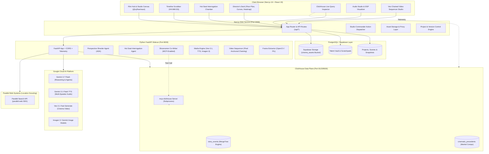

<p align="center">
  
</p>

<h1 align="center">BlendEye</h1>

<p align="center">
  <strong>The Autonomous AI Film Director Studio, Production Planner & Pre-Shoot Simulator.</strong><br>
  <em>Plan the vision. Simulate the performance. Direct the film before shooting a single frame.</em>
</p>

<p align="center">
  🌐 <strong><a href="https://blendeye.harmanita.com">Live Production Studio — blendeye.harmanita.com</a></strong>
</p>
<br>

[](https://nextjs.org/)
[](https://fastapi.tiangolo.com/)
[](https://www.python.org/)
[](https://clickhouse.com/)
[](https://cloud.google.com/vertex-ai)
[](https://deepmind.google/technologies/veo/)
[](https://supabase.com/)
[](LICENSE)

---

## 📽️ Table of Contents

1. [Runtime Integrations](#-runtime-integrations)
2. [What is BlendEye? (The Director's Operating System)](#-what-is-blendeye-the-directors-operating-system)
3. [The Problem: The $100M "Fix It in Post" Fallacy](#-the-problem-the-100m-fix-it-in-post-fallacy)
4. [The 3 Core Directorial Pillars](#-the-3-core-directorial-pillars)
5. [System Architecture](#-system-architecture)
6. [The 4 Director Studio Workspaces](#-the-4-director-studio-workspaces)
   - [Workspace 1: Studio & Scene Planning (Shift+1)](#workspace-1-studio--scene-planning-shift1)
     - [Interactive Story Canvas (@xyflow/react)](#1-interactive-story-canvas-xyflowreact)
     - [Multi-Scene Narrative Hierarchy & Sequencing](#2-multi-scene-narrative-hierarchy--sequencing)
     - [AI Bridge Scene Architect](#3-ai-bridge-scene-architect)
     - [Hollywood Production Stripboard & Shooting Logistics](#4-hollywood-production-stripboard--shooting-logistics)
     - [Global Location Scouting Board & Dossier Hub](#5-global-location-scouting-board--dossier-hub)
     - [2D Spatial Camera Blocking & Floor Plan Engine](#6-2d-spatial-camera-blocking--floor-plan-engine)
     - [Dramatic Tension & Pacing Curve Visualizer](#7-dramatic-tension--pacing-curve-visualizer)
     - [International Box Office & Territory Heatmap](#8-international-box-office--territory-heatmap)
   - [Workspace 2: Pre-Shoot Simulation Suite (Shift+2)](#workspace-2-pre-shoot-simulation-suite-shift2)
     - [The Hot Seat: Time-Gated Character Interrogation](#1-the-hot-seat-time-gated-character-interrogation)
     - [Dynamic Friction & Chemistry Bench](#2-dynamic-friction--chemistry-bench)
     - [Audio Table Read Studio & Voice Timbre Engine](#3-audio-table-read-studio--dsp-room-acoustics)
   - [Workspace 3: Generation Backlot (Shift+3)](#workspace-3-generation-backlot-shift3)
     - [Google Veo 3.1 Sequential Chained Video Studio](#1-google-veo-31-sequential-chained-video-studio)
     - [2.39:1 Anamorphic Storyboard & Concept Art](#2-2391-anamorphic-storyboard--concept-art)
     - [Director's Aesthetic Lookbook](#3-directors-aesthetic-lookbook)
     - [AI Scene Score & Soundtrack Synthesizer](#4-ai-scene-score--soundtrack-synthesizer)
     - [Multiverse Alternate Directorial Takes](#5-multiverse-alternate-directorial-takes)
   - [Workspace 4: Showrunner AI Co-Pilot & Executive Automation (Shift+4)](#workspace-4-showrunner-ai-co-pilot--executive-automation-shift4)
     - [Centralized Showrunner AI (mcp-clickhouse Grounded)](#1-centralized-showrunner-ai-mcp-clickhouse-grounded)
     - [Studio AI Commander (Natural Language Action Runner)](#2-studio-ai-commander-natural-language-action-runner)
     - [Script Supervisor & Continuity Inspector](#3-script-supervisor--continuity-inspector)
     - [Film Fusion / Multiverse Crossover Engine](#4-film-fusion--multiverse-crossover-engine)
     - [Studio Version Control & Takes VCS](#5-studio-version-control--takes-vcs)
     - [Character Lab & Global Talent Vault](#6-character-lab--global-talent-vault)
     - [Production Asset Hub & Supabase Storage](#7-production-asset-hub--supabase-storage)
7. [ClickHouse Integration](#-clickhouse-integration)
8. [Google Cloud AI & Gemini Multimodal Suite](#-google-cloud-ai--gemini-multimodal-suite)
9. [Repository Structure](#-repository-structure)
10. [Local Development & Quickstart](#-local-development--quickstart)
11. [Docker Deployment](#-docker-deployment)
12. [Environment Variables Reference](#-environment-variables-reference)
13. [Benchmark Productions](#-benchmark-productions)
14. [Keyboard Shortcuts Quick Reference](#-keyboard-shortcuts-quick-reference)
15. [License & Acknowledgments](#-license--acknowledgments)

---

## ✅ Runtime Integrations

| Integration | Status | Where it runs |
| :--- | :--- | :--- |
| **Hosted, publicly reachable deployment** | ✅ Live | [blendeye.harmanita.com](https://blendeye.harmanita.com) |
| **Google Cloud AI** | ✅ Active | `google-genai` + `google-adk` invoked across `app/routers/media.py`, `app/services/video_sequencer.py`, `app/agents/*.py` — runtime calls to `gemini-3.7-flash`, `gemini-3.1-flash-tts-preview`, and `veo-3.1-fast-generate-preview`. |
| **ClickHouse via `mcp-clickhouse`** | ✅ Active | `app/services/clickhouse_mcp.py` runs the official `mcp-clickhouse` server as an `McpToolset` on the live Showrunner agent (`app/agents/showrunner.py`) for commercial comps. |
| **ClickHouse Cloud / self-hosted cluster** | ✅ Active | Production deployment connects to **ClickHouse Cloud** with sub-3ms query latencies. |
| **Parallel Web Systems** | ✅ Active | Official `parallel-web` Python SDK (v1.3.3) invoked in `app/services/parallel_search.py`, `app/routers/location_research.py`, and `app/agents/showrunner.py` for real-time location scouting and market comps. |
| **Grafana Labs via `mcp-grafana`** | ✅ Active | Official `grafana/mcp-grafana` server (v1.3.0) and native Prometheus exporter at `/observability/metrics` powering real-time PromQL monitoring and agent pipeline health. |
| **Web frontend** | ✅ Active | Next.js 16 App Router frontend with Tailwind CSS v4, Lucide icons, and `@xyflow/react`. |
| **License** | ✅ Active | [MIT License](LICENSE) |
| **AI SDK surface** | ✅ Single-vendor | Only Google Cloud AI SDKs (`google-genai`, `google-adk`) are imported; no other AI vendor SDKs are present. |

---

## 🌟 What is BlendEye? (The Director's Operating System)

> **BlendEye is the flight simulator for film directors, screenwriters, and showrunners.**

Commercial pilots log hundreds of hours in flight simulators before ever flying passengers. They test turbulence, engine stalls, and crosswinds in a risk-free environment.

Filmmaking, by contrast, has historically had no flight simulator. Directors step onto multimillion-dollar sets with unproven dialogue, unverified spatial camera blocking, untested character chemistry, and fractured pre-production documentation. When pacing drags or a plot point falls apart, the only option has been the disastrous industry mantra: *"We'll fix it in post."*

**BlendEye replaces guesswork with simulation.** It gives directors a unified, interactive digital studio to:
1. **Plan** the entire film: scenes, sluglines, shooting schedules, location dossiers, and international box-office targets.
2. **Simulate** the dramatic reality before cameras roll: interrogate characters under strict **ClickHouse time-gated knowledge firewalls**, pit actors in unscripted chemistry pressure-cookers, test 2D spatial camera sightlines, and listen to theatrical multi-speaker audio table reads with physical room acoustics.
3. **Generate & Direct** high-fidelity cinematic pre-viz: sequential multi-shot **Google Veo 3.1** video sequences with frame-accurate pixel anchoring, 2.39:1 anamorphic storyboards, original scene scores, and 3 distinct directorial takes per scene.

---

## 💡 The Problem: The $100M "Fix It in Post" Fallacy

Traditional pre-production is plagued by two fatal structural flaws:

1. **Character Omniscience ("Writer Leakage")**: Screenwriters write characters who have subconsciously read the end of the script. Characters fail to act with genuine paranoia, foreshadow twists they cannot know, or leak information they haven't learned yet.
2. **Fragmented Directorial Tooling**: Screenplay drafts, 2D camera blocking schematics, location scouting dossiers, cast psychology profiles, and shooting schedules live in disconnected silos. By the time a continuity break or pacing lull is discovered during principal photography, reshoots cost hundreds of thousands of dollars per day.

**BlendEye unifies planning, simulation, and generative directing into a single, cohesive Director's OS.**

---

## 🎯 The 3 Core Directorial Pillars

```
┌────────────────────────────────────────────────────────────────────────────────────────┐
│                                 THE BLENDEYE DIRECTORIAL CYCLE                         │
│                                                                                        │
│     1. PLAN (The Blueprint)             2. SIMULATE (The Flight Sim)   3. DIRECT (The Set)     │
│  ┌───────────────────────────┐       ┌──────────────────────────────┐  ┌────────────────────┐  │
│  │ • Multi-Scene Sequencing  │       │ • ClickHouse Hot Seat        │  │ • Chained Veo 3.1  │  │
│  │ • Visual Backlot Graph    │ ────► │ • Dynamic Chemistry Bench    │─►│ • Pixel Anchoring  │  │
│  │ • Production Stripboard   │       │ • Multi-Speaker Audio Table  │  │ • 2.39:1 Stills    │  │
│  │ • Parallel Web Scouting   │       │ • 2D Spatial Camera Blocking │  │ • AI Film Scoring  │  │
│  │ • Territory Heatmaps      │       │ • 3-Act Tension Pacing Curve │  │ • Multiverse Takes │  │
│  └───────────────────────────┘       └──────────────────────────────┘  └────────────────────┘  │
│                                                     ▲                                          │
│                                                     │ Feedback Loop                            │
│                                                     └──────────────────────────────────────────┘
└────────────────────────────────────────────────────────────────────────────────────────┘
```

---

## 🏗️ System Architecture

BlendEye uses a decoupled, hybrid architecture separating frontend presentation, state persistence, and stateless AI/analytical compute:



---

## 🎛️ The 4 Director Studio Workspaces

BlendEye organizes the directorial workflow into four specialized studio workspaces accessible via top-bar tabs or instant keyboard shortcuts:

| Workspace | Shortcut | Focus Area |
| :--- | :--- | :--- |
| **Studio & Planning** | <kbd>Shift</kbd> + <kbd>1</kbd> | Visual node backlot, multi-scene timeline, stripboard, location scouting, 2D camera blocking, and pacing curves |
| **Simulation Suite** | <kbd>Shift</kbd> + <kbd>2</kbd> | The Hot Seat (time-gated interrogation), unscripted character chemistry bench, and theatrical audio table reads |
| **Generation Backlot** | <kbd>Shift</kbd> + <kbd>3</kbd> | Sequential chained Veo 3.1 video generation, 2.39:1 anamorphic storyboards, film scoring, and multiverse takes |
| **Showrunner AI** | <kbd>Shift</kbd> + <kbd>4</kbd> | Omniscient AI co-director grounded via `mcp-clickhouse` for commercial comps, subtext analysis, and full studio action automation |

---

### Workspace 1: Studio & Scene Planning (<kbd>Shift</kbd> + <kbd>1</kbd>)

The Director's central pre-production planning floor, linking high-level script architecture with boots-on-the-ground shooting logistics.

#### 1. Interactive Story Canvas (`@xyflow/react`)
- **Cinematic Visual Backlot**: A dark-mode, anamorphic-inspired node canvas built with React Flow.
- **Specialized Node Graph Hierarchy**:
  - **Inspiration Node**: Project logline, genre tags, director style cues, and core story secrets.
  - **Scene Master Node**: Script synopsis, screenplay excerpt, scene placement timecode, and direct script editor launcher.
  - **Character Perspective Nodes**: Visual cast cards with live character dials, subtext ratios, and current knowledge states.
  - **Storyboard Visual Node**: 2.39:1 anamorphic widescreen keyframes generated with Imagen 3.
  - **Director's 2D Floor Plan Node**: Direct architectural blocking overlay linked to the scene.
  - **Bridge Scene Node**: Interstitial scene linking multiple narrative sequences together.
- **Auto-Tidy Backlot**: Deterministic horizontal layout organizer keeping production nodes organized cleanly as projects scale.
- **Studio Inspector Sidebar**: Resizable parameter inspector providing granular node configuration, cast assignments, and slugline overrides.

#### 2. Multi-Scene Narrative Hierarchy & Sequencing
- **Feature-Length Structure**: Organize entire feature films or episodic pilots into numbered scenes with sluglines (`INT. BANK VAULT - NIGHT`), summary beats, and runtime budgets.
- **Timeline Canvas & Sequence Manager**: Interactive scene reordering, duration scaling, and timecode placement (`00:15:30`, `00:48:00`).
- **Full Screenplay Viewer & Live Editor**: Industry-standard Hollywood formatted script editor with character POV tagging, dialogue formatting, and instant script saves.

#### 3. AI Bridge Scene Architect
- **Connective Tissue Synthesis**: Disconnected narrative sequences often cause jarring pacing drops. The Bridge Scene generator analyzes Scene $N$ and Scene $N+1$, detects emotional or logistical gaps, and drafts a seamless interstitial scene maintaining character voice and narrative momentum.

#### 4. Hollywood Production Stripboard & Shooting Logistics
- **Day/Night Production Strips**: Automatically parses screenplay text to classify scenes into standard Hollywood stripboard tags (`INT/EXT`, `DAY/NIGHT/DUSK/DAWN`).
- **Shooting Day Breakdown**: Aggregates estimated page counts (eighths of a page), required cast IDs, location tags, and budget tier allocations.
- **Production Efficiency Optimization**: Group scenes by location and cast availability to minimize company moves.

#### 5. Global Location Scouting Board & Dossier Hub
- **Real-World Grounding via Parallel Web Systems**: Scout filming locations with Gemini connected live to the Parallel Search API, with ADK's native Google Search tool wired in as a resilience fallback if Parallel is unavailable.
- **Architectural & Geospatial Dossiers**: Fetches real geographic coordinates, architectural style descriptions, sun angles / golden hour windows, and seasonal weather patterns.
- **Permits & Logistics**: Summarizes filming permit requirements, sound ordinances, and equipment access.
- **Multi-Currency Budget Calculator**: Compares location candidate daily rates across USD, EUR, GBP, CAD, and AUD with budget cap policy alerts.
- **Interactive Location Q&A**: Chat directly with a specialized location scout agent to resolve venue feasibility questions.

#### 6. 2D Spatial Camera Blocking & Floor Plan Engine
- **Overhead Stage Schematic**: Draggable actor tokens and camera positions on a customizable 2D floor plan map.
- **Camera Lens Presets**: Switch between Wide Master (35mm), Over-The-Shoulder (50mm), Intimate Close-Up (85mm), and High Suspense POV (24mm).
- **Sightlines & Practical Lighting**: Visualizes actor sightline vectors, camera coverage cones, and directional practical lighting beams.
- **Direct Veo 3.1 Dispatch**: Send camera focal length, motion path (Pan, Track, Crane, Push-in), and staging notes straight into the Google Veo video generation prompt with one click.

#### 7. Dramatic Tension & Pacing Curve Visualizer
- **Recharts 3-Act Tension Graph**: Continuous narrative tension visualizer plotting scene intensity against runtime seconds.
- **Multi-POV Stakes Tracking**: Displays overall scene tension alongside individual character POV tension lines to reveal emotional asymmetry and identify structural narrative lag.

#### 8. International Box Office & Territory Heatmap
- **D3 Geo / TopoJSON Interactive Global Map**: Visualizes projected box-office appeal across North America, Europe, Asia-Pacific, Latin America, and MENA.
- **ClickHouse Grounded Benchmarks**: Queries ClickHouse's `cinematic_precedents` table (*Heat*, *Sicario*, *Alien*, *Mad Max: Fury Road*) to drive the territorial audience-retention projections.
- **Data provenance — read before quoting a number**: `cinematic_precedents` is **hand-authored demo benchmark data**, seeded from `agent-service/app/services/clickhouse_store.py`. The film titles and craft notes are real; the `tension_level` and `audience_retention_pct` values are illustrative figures chosen by hand, **not** measured box-office or audience-retention data from any dataset. They exist so the market/territory and Showrunner views have stable, non-hallucinated rows to render. Treat the percentages as placeholder values, not as research.

---

### Workspace 2: Pre-Shoot Simulation Suite (<kbd>Shift</kbd> + <kbd>2</kbd>)

The Director's virtual rehearsal stage — test actors, dialogue, and dramatic friction under realistic psychological constraints before principal photography.

#### 1. The Hot Seat: Time-Gated Character Interrogation
- **Live Character Interrogation**: Chat directly with any character in Hollywood dialogue script format (`CHARACTER: Line`).
- **ClickHouse Sub-Millisecond Knowledge Firewalls**: The interrogation agent evaluates the exact minute on the timeline (`WHERE event_timestamp <= '00:34:00'`). Characters answer with genuine ignorance of future plot twists, unseen betrayals, or hidden motives.
- **Paranoia & Speculation Modeling**: If an interviewer baits a character with future facts, the character reacts authentically — dismissing it as absurd hearsay or mounting paranoia rather than breaking character.
- **"Insert into Script" Micro-Interaction**: Discovered a spontaneous line of improvised dialogue that crackles with subtext? Click the filmstrip button to insert the dialogue directly into the screenplay draft.

#### 2. Dynamic Friction & Chemistry Bench
- **Unscripted Relational Stress-Testing**: Direct any two characters into a spontaneous pressure-cooker scenario (e.g., *"Stuck in a stalled service elevator with a 2-minute security countdown"* or *"Cornered in an interrogation room with one confession immunity deal"*).
- **Conflict Simulation**: The simulation models psychological friction, clashing subtext, and competing character secrets in real time, helping directors discover genuine character chemistry before shooting.

#### 3. Audio Table Read Studio & DSP Room Acoustics
- **Multi-Speaker Theatrical Table Reads**: Full script audio readouts synthesized using **Gemini 3.1 Flash TTS** with native `MultiSpeakerVoiceConfig`.
- **Character Voice Timbre Mapping**: Automatically assigns distinct vocal personas (`Fenrir`, `Aoede`, `Charon`, `Kore`, `Puck`, `Zephyr`) to individual cast members.
- **Directorial Vocal Controls**: Fine-tune speech delivery rate (0.8x to 1.3x), pitch shifting, and formant chest resonance.
- **Acoustic Space Simulation (DSP)**: Simulate the acoustic environment of the scene:
  - *Dry Soundstage*: Close-mic, zero room reflection.
  - *Cathedral / Echo Chamber*: Cavernous reverberation and long acoustic decay.
  - *Subterranean Metal Vault*: Cold, metallic reflections and tight acoustic slapback.
- **Synchronized Visualizer**: Dual audio canvas visualization with synchronized line-by-line script highlighting as dialogue plays.

---

### Workspace 3: Generation Backlot (<kbd>Shift</kbd> + <kbd>3</kbd>)

Transform director blocking and screenplay text into production-ready cinematic pre-viz assets.

#### 1. Google Veo 3.1 Sequential Chained Video Studio
- **Veo 3.1 Cinematic Video Generation**: Direct renders of high-definition 2.39:1 / 16:9 cinematic video clips conditioned on storyboard prompts, character reference art, and camera blocking parameters.
- **Chained Multi-Shot Sequencer (`services/video_sequencer.py`)**:
  - Overcomes the single-shot 4–8 second duration ceiling to generate continuous multi-shot scene sequences.
  - **Pixel Anchoring (`frame_extractor.py`)**: Automatically extracts the exact last frame of Shot $N$ via OpenCV/PIL and feeds it into Veo 3.1 as the image-conditioning reference for Shot $N+1$, preventing visual drift and character appearance distortion.
  - **Locked Continuity Bibles**: Automatically generates rigid continuity bibles (wardrobe, key lighting angle, color palette, camera motion) across shot chains to prevent generative hallucination across long takes.

#### 2. 2.39:1 Anamorphic Storyboard & Concept Art
- **Anamorphic Widescreen Keyframes**: Generates 2.39:1 widescreen storyboard stills with Imagen 3 / Gemini Image models.
- **Cinematic Lighting & Lens Grading**: Prompts incorporate optical lens characteristics: subtle cyan anamorphic streak flares, shallow depth of field, natural halation, and organic 35mm film grain.

#### 3. Director's Aesthetic Lookbook
- **Visual Styling Dossier**: Centralized moodboard housing color palettes, costume swatches, lighting reference schemes, and atmospheric concept art.

#### 4. AI Scene Score & Soundtrack Synthesizer
- **Context-Aware Score Prompting**: Analyzes scene emotional beats, dialogue intensity, and pacing to synthesize rich musical composition prompts.
- **Score Take Auditioning**: Generates and manages multiple score takes per scene, allowing directors to audition different musical vibes (electronic pulse, orchestral dread, minimalist piano) and lock a "Master Score Take."
- **Automatic Lyric & Motif Drafting**: Drafts atmospheric lyrics or vocal motifs tailored to the scene's emotional climax.

#### 5. Multiverse Alternate Directorial Takes
- **3-Director Take Generator**: Direct 3 radically distinct directorial visions per scene with one click:
  - *Psychological Slow-Burn (A24 Style)*: Whispered subtext, negative space, pregnant pauses, and lingering camera setups.
  - *Neo-Noir Confrontation (Michael Mann / David Fincher)*: Cold procedural calculation, razor-sharp dialogue, and relentless rhythmic intensity.
  - *Visceral Ticking Clock (Christopher Nolan / Denis Villeneuve)*: Urgent sensory pressure, breathless dialogue delivery, and propulsive narrative drive.
- **1-Click Production Apply**: Audition takes side-by-side and apply the winning cut directly into the master screenplay with one click.

---

### Workspace 4: Showrunner AI Co-Pilot & Executive Automation (<kbd>Shift</kbd> + <kbd>4</kbd>)

The Director's autonomous executive partner — providing commercial market comps, subtext analysis, script doctoring, and natural language studio automation.

#### 1. Centralized Showrunner AI (`mcp-clickhouse` Grounded)
- **Omniscient Creative Co-Pilot**: An autonomous executive showrunner analyzing dramatic subtext, narrative pacing, and structural reversals.
- **Live Tool Calling via `mcp-clickhouse`**: The Showrunner queries ClickHouse's `cinematic_precedents` table via the official Model Context Protocol (MCP) server mid-conversation, citing stored commercial comps and retention benchmarks to ground creative recommendations. (See the provenance note in the ClickHouse section below — these rows are hand-authored demo data.)
- **Interactive Script Doctoring**: Apply targeted rewrites, heighten conflict, or resolve third-act bottlenecks directly through natural conversation.

#### 2. Studio AI Commander (Natural Language Action Runner)
- **Voice / Text Executive Director**: Direct the entire studio with high-level natural language instructions:
  - *"Add a corrupt security specialist named Silas with high emotional volatility"*
  - *"Increase the dramatic tension in the vault confrontation scene"*
  - *"Rearrange the sequence slates and run a continuity check"*
- **Multi-Step CRUD Automation**: Automatically creates characters, edits scenes, spawns canvas nodes, updates screenplay text, and dispatches version snapshots in a single transactional pass.

#### 3. Script Supervisor & Continuity Inspector
- **Automated Script Supervisor**: Deep narrative analysis scanning for timeline paradoxes, unearned character knowledge leaks, contradictory character motivations, and missing physical props.
- **Severity Classification**: Categorizes continuity issues into Critical Breaks, Character Inconsistencies, and Pacing Advisories with one-click fix recommendations.

#### 4. Film Fusion / Multiverse Crossover Engine
- **Narrative Reconciliation**: Reconciles two completely different screenplays or franchise storylines.
- **Automated Timeline Merging**: Resolves character role overlaps, merges conflicting narrative events, and synthesizes a unified, sharded ClickHouse story timeline.

#### 5. Studio Version Control & Takes VCS
- **Studio VCS**: Full project snapshotting with commit messages, revision history, and instant rollback.
- **Takes History**: Audition, compare, and restore earlier creative directions with non-destructive versioning.

#### 6. Character Lab & Global Talent Vault
- **Deep Character Architecture**: Design rich character profiles with psychological archetypes, speech cadences, subtext ratios, and casting comps.
- **Personality Dials**: Calibrate confidence, verbal pacing, emotional volatility, and unique speech quirks.
- **Global Talent Vault**: Persist characters globally in Supabase for reuse across different productions and franchise slates.

#### 7. Production Asset Hub & Supabase Storage
- **Media Asset Library**: Centralized asset manager for generated character portraits, storyboard stills, Veo video takes, floor plan schematics, and audio tracks.
- **Cloud Delivery**: Backed by Supabase Storage (`cinema_assets` public bucket) with CDN caching and metadata tagging.

---

## ⚡ ClickHouse Integration

ClickHouse is not a passive database in BlendEye — **it is the fundamental data engine powering the time-gate mechanic**:

```
+---------------------------------------------------------------------------------------+
| CLICKHOUSE TIME-GATE ENGINE                                                           |
|                                                                                       |
|   Master Script                                                                       |
|         │                                                                             |
|         ▼                                                                             |
|   Perspective Sharder Agent                                                           |
|         │                                                                             |
|         ▼                                                                             |
|   ┌───────────────────────────────────────────────────────────────────────────────┐   |
|   │ ClickHouse `story_events` Table                                               │   |
|   │ ORDER BY (project_id, character_name, event_timestamp)                        │   |
|   └───────────────────────────────────────────────────────────────────────────────┘   |
|         │                                                                             |
|         │   TIMELINE SCRUBBER (e.g. 00:34:00)                                         |
|         ▼                                                                             |
|   SELECT event_type, content FROM story_events                                        |
|   WHERE project_id = ? AND character_name = ? AND event_timestamp <= '00:34:00'       |
|   ORDER BY event_timestamp                                                            |
|         │                                                                             |
|         ▼ [1-3ms query latency]                                                       |
|   ┌───────────────────────────────────────────────────────────────────────────────┐   |
|   │ Knowledge Firewall Context Fed to Gemini Hot-Seat Agent                       │   |
|   │ Only knows: keys in vest                                                      │   |
|   │ Explicitly UNAWARE of: Elena's betrayal                                       │   |
|   └───────────────────────────────────────────────────────────────────────────────┘   |
+---------------------------------------------------------------------------------------+
```

### 1. `story_events` MergeTree Table
```sql
CREATE TABLE IF NOT EXISTS story_events (
    project_id String,
    character_name String,
    event_timestamp String,   -- HH:MM:SS format, lexicographically sortable
    event_type Enum8('known_fact' = 1, 'unaware_of' = 2, 'location' = 3, 'objective' = 4),
    content String,
    created_at DateTime DEFAULT now()
) ENGINE = MergeTree()
ORDER BY (project_id, character_name, event_timestamp);
```

### 2. Time-Gate Query Pattern
Every scrub on the timeline or question asked in the Hot Seat executes:
```sql
SELECT event_type, content
FROM story_events
WHERE project_id = {project_id:String}
  AND character_name = {character_name:String}
  AND event_timestamp <= {at_timestamp:String}
ORDER BY event_timestamp;
```

### 3. `cinematic_precedents` Table (Commercial Grounding)
Powers the territorial comps and retention metrics cited by the Showrunner.

> **Provenance:** this table is seeded from hand-authored demo rows
> (`_DEFAULT_PRECEDENTS` in `agent-service/app/services/clickhouse_store.py`).
> The film titles and craft notes are real; `tension_level` and
> `audience_retention_pct` are illustrative hand-picked values, not measured
> box-office data. They give the market and Showrunner views stable,
> non-hallucinated rows to render — they are not research.

```sql
CREATE TABLE IF NOT EXISTS cinematic_precedents (
    genre String,
    trope String,
    historical_reference String,
    tension_level Float32,
    commercial_territory String,
    audience_retention_pct Float32,
    precedent_example String
) ENGINE = MergeTree()
ORDER BY (genre, trope);
```

### 4. `mcp-clickhouse` Integration (Runtime Agent Tool-Use)
BlendEye uses ClickHouse through **two real, runtime-invoked paths**:

- **Direct driver** (`clickhouse-connect`): `app/services/clickhouse_store.py` — handles high-throughput timeline scrubbing and perspective event sharding (application logic).
- **Official MCP server** (`mcp-clickhouse`): `app/services/clickhouse_mcp.py` launches the official `mcp-clickhouse` console script as a stdio subprocess and wires it into Google ADK as an `McpToolset`. This toolset is attached directly to the **Showrunner agent** (`app/agents/showrunner.py`), allowing the agent to issue live, read-only ClickHouse queries during conversation to ground script notes in real commercial comps.

```python
# app/services/clickhouse_mcp.py
from google.adk.tools.mcp_tool.mcp_toolset import McpToolset
from mcp import StdioServerParameters

def build_clickhouse_toolset() -> McpToolset:
    return McpToolset(
        connection_params=StdioServerParameters(
            command="mcp-clickhouse", args=[], env=env,
        ),
    )

# app/agents/showrunner.py — attached to the live agent
tools.append(build_clickhouse_toolset())
Agent(..., tools=tools)
```

The production deployment connects to a **ClickHouse Cloud** cluster, ensuring both direct time-gate queries and MCP agent tool calls run against a real hosted instance.

### 5. Live Query Inspector & Telemetry (<kbd>Shift</kbd> + <kbd>C</kbd>)
The frontend includes a real-time **ClickHouse Query Inspector** drawer displaying:
- Exact executed SQL statements
- Server response times (averaging 1–4ms)
- Total sharded events analyzed
- Studio `/metrics` endpoint ready for Prometheus and Grafana telemetry

---

## 🤖 Google Cloud AI & Gemini Multimodal Suite

BlendEye harnesses Google Cloud's multimodal model family:

| Capability | Model | Role in Studio |
| :--- | :--- | :--- |
| **Reasoning & Agents** | `gemini-3.7-flash` | Master screenplay authoring, perspective sharding, Hot Seat interrogation, Showrunner script doctoring, continuity checking, bridge scene generation, and studio action orchestration |
| **Multi-Speaker TTS** | `gemini-3.1-flash-tts-preview` | Theatrical multi-speaker audio table reads with native `MultiSpeakerVoiceConfig`, actor timbres (`Fenrir`, `Aoede`, etc.), and DSP room acoustics |
| **Video Generation** | `veo-3.1-fast-generate-preview` | 2.39:1 widescreen video renders, camera motion control, and sequential multi-shot chained generation with last-frame pixel conditioning |
| **Visual Concepts** | `gemini-3.1-flash-image` / `gemini-3-pro-image` | Anamorphic storyboard keyframes, character wardrobe portraits, and director lookbook moodboards |

Location scouting grounding is powered by **Parallel Web Systems** (primary) — see the Parallel Web Systems Integration section — with ADK's native Google Search tool attached only as a fallback if Parallel is unconfigured or unreachable.

---

## 📂 Repository Structure

```
agentic_cinema/
├── README.md                          # Comprehensive project documentation
├── DEMO_VIDEO_SCRIPT.md               # 3-minute product walkthrough video script
├── docker-compose.yml                 # Local ClickHouse & full-stack container profiles
├── .env.example                       # Root environment variable template
├── supabase/
│   └── schema.sql                     # PostgreSQL tables, RLS policies, and Storage bucket
├── agent-service/                     # Python 3.12 / FastAPI Sidecar
│   ├── pyproject.toml                 # Project metadata & locked dependencies (uv)
│   ├── uv.lock                        # Deterministic dependency lockfile
│   ├── Dockerfile                     # Container definition for Python sidecar
│   ├── app/
│   │   ├── main.py                    # FastAPI entrypoint, CORS, routers, /metrics
│   │   ├── config.py                  # Pydantic Settings & environment validation
│   │   ├── agents/                    # Gemini & Google ADK autonomous agents
│   │   │   ├── hot_seat.py            # Time-gated character interrogation
│   │   │   ├── perspective_sharder.py # Screenplay event extraction into ClickHouse
│   │   │   ├── showrunner.py          # Omniscient co-writer with MCP tool calling
│   │   │   ├── continuity_checker.py  # Script logic & paradox inspector
│   │   │   ├── character_lab.py       # Character generator & casting comp agent
│   │   │   ├── location_researcher.py # Location scouting grounded via Parallel Web Systems (Google Search fallback)
│   │   │   ├── multiverse_takes.py    # 3-director take generator
│   │   │   └── shotlist_generator.py  # Continuity bible & shot planner
│   │   ├── routers/                   # REST API routes (media, script, hot-seat, etc.)
│   │   └── services/                  # ClickHouse store, MCP bridge, video sequencer
│   │       ├── clickhouse_store.py    # Direct ClickHouse driver operations
│   │       ├── clickhouse_mcp.py      # Official mcp-clickhouse server subprocess
│   │       ├── video_sequencer.py     # Multi-shot chained Veo generation
│   │       └── frame_extractor.py     # Last-frame pixel anchoring via OpenCV/PIL
└── web/                               # Next.js 16 App Router (TypeScript + Tailwind v4)
    ├── package.json                   # Web dependencies (@xyflow/react, Lucide, Recharts)
    ├── Dockerfile                     # Production Next.js container definition
    ├── app/                           # App router pages & API proxy routes
    │   ├── page.tsx                   # Studio Hub landing page
    │   ├── studio/[projectId]/page.tsx# Main interactive director's studio canvas
    │   └── api/                       # Next.js backend routes to Supabase & sidecar
    ├── components/
    │   ├── cinema/                    # Core Studio UI components
    │   │   ├── story-canvas.tsx       # React Flow canvas wrapper
    │   │   ├── graph-nodes.tsx        # Custom node designs (Scene, Character, Visual)
    │   │   ├── timeline-scrubber.tsx  # Timecode scrubber with event markers
    │   │   ├── hot-seat-chat.tsx      # Knowledge-bounded character chat
    │   │   ├── floor-plan-view.tsx    # 2D architectural camera blocking
    │   │   ├── tension-curve-view.tsx # 3-act narrative tension curves
    │   │   ├── table-read-player.tsx  # Multi-speaker audio player with visualizer
    │   │   ├── territory-heatmap-view.tsx # Global box office D3 map
    │   │   ├── generation-studio-view.tsx # Chained Veo video sequence view
    │   │   ├── character-lab-dialog.tsx   # Character creator & talent vault
    │   │   ├── location-board.tsx         # Location scouting & comparison matrix
    │   │   ├── scene-score-view.tsx       # AI film score composer & takes
    │   │   ├── stripboard-view.tsx        # Production shooting stripboard
    │   │   └── clickhouse-inspector.tsx   # Live SQL telemetry console
    │   └── ui/                        # shadcn/ui design primitives
    └── lib/                           # Stores, version control & client SDKs
        ├── project-store.ts           # Cloud-backed project/talent/scratchpad cache (no browser storage)
        ├── studio-commander.ts        # AI Studio Commander multi-step action runner
        ├── supabase-store.ts          # Postgres/Supabase synchronization layer
        └── asset-store.ts             # Media asset library state (cloud cache)
```

---

## 🚀 Local Development & Quickstart

### Prerequisites
- **Node.js**: v20+ with `npm`
- **Python**: v3.12+ with [uv](https://docs.astral.sh/uv/) installed
- **Docker**: For running ClickHouse locally
- **Google Cloud API Key**: A valid `GOOGLE_API_KEY` enabled for Gemini models
- **Parallel Web Systems API Key**: `PARALLEL_API_KEY` for live location scouting search grounding
- **Grafana Token**: (Optional) `GRAFANA_SERVICE_ACCOUNT_TOKEN` and `GRAFANA_URL` for MCP Grafana observability
- **Supabase Account**: **Required** — BlendEye is cloud-only and login-gated. Without it there is no persistence and no way to sign in.

---

### Step 1: Clone the Repository & Configure Root Environment

```bash
git clone https://github.com/HarmanPreet-Singh-XYT/blendeye.git
cd blendeye

# Copy the root environment template
cp .env.example .env
```

Ensure `CLICKHOUSE_PASSWORD` in `.env` is set (e.g. `CLICKHOUSE_PASSWORD=devpassword`). ClickHouse HTTP authentication requires a password.

---

### Step 2: Start ClickHouse in Docker

Run ClickHouse in the background:
```bash
docker compose up -d clickhouse
```
- ClickHouse HTTP interface: `http://localhost:8123`
- Native TCP interface: `localhost:9000`

---

### Step 3: Start the Python Agent Service

```bash
cd agent-service
cp .env.example .env
```

Edit `agent-service/.env` with your API keys and configuration:
```env
# Google Cloud AI
GOOGLE_API_KEY=your_gemini_api_key_here
GEMINI_MODEL=gemini-3.7-flash

# ClickHouse Database
CLICKHOUSE_HOST=localhost
CLICKHOUSE_PORT=8123
CLICKHOUSE_USER=default
CLICKHOUSE_PASSWORD=devpassword
CLICKHOUSE_DATABASE=default
CLICKHOUSE_SECURE=false

# Parallel Web Systems (Real-Time Search Grounding)
PARALLEL_API_KEY=your_parallel_api_key_here

# Grafana Labs (Observability & MCP)
GRAFANA_URL=https://your-stack.grafana.net
GRAFANA_SERVICE_ACCOUNT_TOKEN=your_grafana_service_account_token_here

# Supabase Storage (Persists Veo 3.1 Videos & Generated Audio)
SUPABASE_URL=https://your-project.supabase.co
SUPABASE_SECRET_KEY=your_supabase_secret_or_service_role_key

# CORS & Runtime Environment
ALLOWED_ORIGINS=["http://localhost:3000"]
ENVIRONMENT=development
```

Sync dependencies and start the FastAPI development server:
```bash
uv sync
uv run uvicorn app.main:app --reload --port 8000
```
- Interactive API Documentation: `http://localhost:8000/docs`
- Health Check: `http://localhost:8000/health`
- Studio Telemetry & Prometheus Metrics: `http://localhost:8000/metrics`

---

### Step 4: Start the Next.js Frontend

In a new terminal:
```bash
cd web
cp .env.example .env
```

Edit `web/.env` with your backend endpoint and Supabase credentials:
```env
AGENT_SERVICE_URL=http://localhost:8000

# Supabase — App state persistence, project versioning, and auth
NEXT_PUBLIC_SUPABASE_URL=https://your-project.supabase.co
NEXT_PUBLIC_SUPABASE_PUBLISHABLE_KEY=your_supabase_publishable_or_anon_key
SUPABASE_SECRET_KEY=your_supabase_secret_or_service_role_key
```

Install packages and run the Next.js development server:
```bash
npm install
npm run dev
```

Open [http://localhost:3000](http://localhost:3000) in your browser!

---

### Step 5: (Required) Initialize Supabase Database

BlendEye is cloud-only and login-gated, so Supabase is **required** — there is no local/offline mode.
1. Navigate to the SQL Editor in the Supabase Dashboard.
2. Paste the contents of `supabase/schema.sql` and run.
3. This provisions:
   - `projects`, `scratchpad_notes`, `talent_vault`, `project_snapshots`, `generation_cache`, and `assets` tables.
   - Row-Level Security (RLS) policies scoping every row to its owning account. Anonymous clients get no access to any of these tables.
   - The `cinema_assets` storage bucket for media uploads.
4. Upgrading an existing database? Run `supabase/cleanup-guest-data.sql` once to remove the
   orphaned `user_id IS NULL` demo rows from the previous anonymous mode.

---

## 🔐 Storage & Access Model

BlendEye keeps **exactly one copy of your work, in the cloud**.

- **No browser persistence.** Projects, talent vault entries, scratchpad notes, asset records,
  chat transcripts and version history are never written to `localStorage`/`sessionStorage`. The
  app hydrates an in-memory cache from Supabase on sign-in and drops it on sign-out, so one
  account's work can never leak into the next session on the same browser. Legacy keys from
  earlier versions are purged automatically on first load.
- **Sign-in required.** `/dashboard` and everything under `/studio/**` redirect to `/login` when
  there is no session. The marketing surfaces (`/`, `/showcase`, `/canvas-demo`) stay public.
- **No demo/seed data.** New accounts start with an empty slate. The *Load Demo: The Vault
  Protocol* button on the dashboard is a convenience preset — it pre-fills the New Production
  wizard and runs the normal generation + sharding pipeline into your own account.
- **The one exception** is Supabase's own auth client session (stored under `sb-*-auth-token`),
  which is what keeps you signed in across a refresh. That is Supabase's storage, not app data.

---

## 🐳 Docker Deployment

To build and run the entire stack (ClickHouse, Python sidecar, and Next.js) containerized:

```bash
# Provide GOOGLE_API_KEY in root .env, then run:
docker compose --profile full up --build
```

- **Web Application**: `http://localhost:3000`
- **Agent Service**: `http://localhost:8000`
- **ClickHouse**: `http://localhost:8123`

---

## ⚙️ Environment Variables Reference

### Google Cloud AI Platform (Required)
| Variable | Scope | Description | Default |
| :--- | :--- | :--- | :--- |
| `GOOGLE_API_KEY` | Agent Service / Web | Google Cloud GenAI API Key for Gemini & Veo models | *(Required)* |
| `GEMINI_MODEL` | Agent Service | Primary reasoning agent model identifier | `gemini-3.7-flash` |
| `GOOGLE_GENAI_USE_VERTEXAI` | Agent Service | Set `true` to authenticate via Google Cloud Vertex AI | `false` |
| `GOOGLE_CLOUD_PROJECT` | Agent Service | Google Cloud Project ID (when using Vertex AI) | *(Optional)* |
| `GOOGLE_CLOUD_LOCATION` | Agent Service | Google Cloud Region (when using Vertex AI) | `us-central1` |

### ClickHouse Database
| Variable | Scope | Description | Default |
| :--- | :--- | :--- | :--- |
| `CLICKHOUSE_HOST` | Agent Service | Hostname of ClickHouse server (local or Cloud) | `localhost` / `clickhouse` |
| `CLICKHOUSE_PORT` | Agent Service | ClickHouse HTTP port (`8123` for local, `8443` for Cloud) | `8123` |
| `CLICKHOUSE_USER` | Agent Service | ClickHouse database username | `default` |
| `CLICKHOUSE_PASSWORD` | Agent Service / Root | ClickHouse password (required for HTTP auth) | `devpassword` |
| `CLICKHOUSE_DATABASE` | Agent Service | ClickHouse database name | `default` |
| `CLICKHOUSE_SECURE` | Agent Service | Enable TLS encryption (must be `true` for ClickHouse Cloud) | `false` |

### Parallel Web Systems
| Variable | Scope | Description | Default |
| :--- | :--- | :--- | :--- |
| `PARALLEL_API_KEY` | Agent Service | Parallel Web Systems Search API Key for real-time location scouting and municipal fee lookups | *(Required for live search)* |

### Grafana Labs
| Variable | Scope | Description | Default |
| :--- | :--- | :--- | :--- |
| `GRAFANA_URL` | Agent Service | Hosted Grafana instance URL for PromQL telemetry | `https://your-stack.grafana.net` |
| `GRAFANA_SERVICE_ACCOUNT_TOKEN` | Agent Service | Service account token for official `mcp-grafana` server | *(Optional)* |

### Supabase (Auth, Cloud State & Media Storage — required)
| Variable | Scope | Description | Default |
| :--- | :--- | :--- | :--- |
| `NEXT_PUBLIC_SUPABASE_URL` | Web App | Public Supabase project URL | *(Required)* |
| `NEXT_PUBLIC_SUPABASE_PUBLISHABLE_KEY` | Web App | Modern Supabase publishable client API key | *(Required)* |
| `NEXT_PUBLIC_SUPABASE_ANON_KEY` | Web App | Legacy alias for the publishable client key | *(Optional)* |
| `SUPABASE_SECRET_KEY` | Web App / Agent Service | Supabase secret key / service role key for RLS bypass | *(Required for uploads & cache)* |
| `SUPABASE_SERVICE_ROLE_KEY` | Web App | Legacy alias for the service role secret key | *(Optional)* |
| `SUPABASE_URL` | Agent Service | Supabase project URL for persisting Veo videos to storage | *(Optional)* |

### Networking & Runtime Environment
| Variable | Scope | Description | Default |
| :--- | :--- | :--- | :--- |
| `AGENT_SERVICE_URL` | Web App | HTTP endpoint to access Python FastAPI backend sidecar | `http://localhost:8000` |
| `ALLOWED_ORIGINS` | Agent Service | JSON array or comma-separated list of allowed CORS origins | `["http://localhost:3000"]` |
| `ENVIRONMENT` | Agent Service | Runtime environment descriptor (`development` / `production`) | `development` |


---

## 🎬 Benchmark Productions

BlendEye comes out of the box with curated benchmark productions ready for immediate exploration:

### 1. *The Vault Heist* (Crime / Suspense Thriller)
- **Setting**: Sub-basement vault, Manhattan Financial District.
- **Dramatis Personae**:
  - **Marcus**: Vault technician with a code of ethics.
  - **Elena**: Tactical mastermind hiding a catastrophic corporate vendetta.
  - **Teo**: Lookout and communications specialist monitoring police frequencies.
- **The Scrubbing Revelation**:
  - Interrogate Marcus at `00:34:00`: Defends the keys in his canvas vest with honest ignorance.
  - Interrogate Marcus at `00:52:00`: After Elena locks the blast doors from the outside, Marcus realizes the keys were taken and reveals the backup airshaft.

### 2. *Deep Space Airlock* (Sci-Fi / Psychological Horror)
- **Setting**: Research Station *Charybdis*, Jovian Orbit.
- **Dramatis Personae**:
  - **Commander Vance**: Station veteran clinging to protocol under terminal decompression threats.
  - **Dr. Arlo**: Xenobiologist harboring contaminated orbital samples.
  - **Engineer Ray**: Life-support specialist struggling to balance oxygen reserves.
- **The Scrubbing Revelation**:
  - Interrogate Dr. Arlo before the quarantine seal breaches: Insists sample canisters are inert.
  - Interrogate Dr. Arlo post-breach: Confesses the biological organism reacts to electrical current.

---

## ⌨️ Keyboard Shortcuts Quick Reference

| Shortcut | Action |
| :--- | :--- |
| <kbd>Shift</kbd> + <kbd>1</kbd> | Switch to **Studio & Scene Planning** Workspace |
| <kbd>Shift</kbd> + <kbd>2</kbd> | Switch to **Pre-Shoot Simulation Suite** |
| <kbd>Shift</kbd> + <kbd>3</kbd> | Switch to **Generation Backlot** (Veo 3.1 & Pre-viz) |
| <kbd>Shift</kbd> + <kbd>4</kbd> | Switch to **Showrunner AI Co-Pilot** |
| <kbd>Shift</kbd> + <kbd>C</kbd> | Toggle **ClickHouse Live Query Inspector** & Telemetry |

---

## 📄 License & Acknowledgments

- Released under the **[MIT License](LICENSE)**.
- Powered by [Google Cloud AI](https://cloud.google.com/vertex-ai) and [ClickHouse](https://clickhouse.com/).
